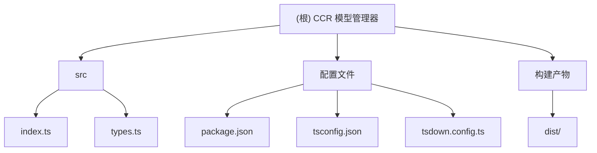

# CCR 模型管理器 - AI 上下文文档

## 项目愿景

为 Claude Code Router (CCR) 用户提供一个简洁、高效的命令行工具，用于管理模型配置，支持交互式选择模型提供商和模型ID，并自动更新配置文件和重启CCR服务。

## 架构总览




## 模块索引

| 模块路径 | 职责 | 入口文件 | 状态 |
|---------|------|---------|------|
| `src/` | 核心业务逻辑 | `index.ts` | 🟢 活跃 |
| `src/types.ts` | TypeScript 类型定义 | `types.ts` | 🟢 活跃 |

## 运行与开发

### 开发环境要求
- Node.js 18+
- pnpm 8+

### 开发命令
```bash
# 安装依赖
pnpm install

# 开发模式（监听文件变化）
pnpm run dev

# 构建项目
pnpm run build

# 发布前构建
pnpm run prepublishOnly
```

### 二进制命令
```bash
# 列出所有可用的模型提供商和模型ID
cmm list

# 选择模型提供商和模型ID
cmm select
```

## 测试策略

当前项目暂无自动化测试，建议添加：
- 单元测试：测试配置文件读取、解析逻辑
- 集成测试：测试与CCR配置文件的交互
- CLI 测试：测试命令行参数和交互流程

## 编码规范

### TypeScript 配置
- 目标：ES2020
- 模块系统：CommonJS
- 严格模式：启用
- 声明文件：启用
- 源码映射：启用

### 代码风格
- 使用 TypeScript 严格模式
- 导入顺序：第三方库 → 项目模块
- 错误处理：使用 try-catch 包装异步操作
- 命名约定：驼峰命名法，类名使用PascalCase

## AI 使用指引

### 项目理解要点
1. **核心功能**：读取CCR配置文件，提供交互式模型选择界面
2. **配置文件位置**：`~/.claude-code-router/config.json`
3. **关键数据结构**：Provider、Router、CCRConfig
4. **主要命令**：`select`（交互式选择）、`list`（列出可用模型）

### 开发相关
- 主入口：`src/index.ts`
- 类型定义：`src/types.ts`
- 构建工具：tsdown
- 打包目标：Node.js 18+

### 修改建议
- 添加错误处理的统一机制
- 考虑支持配置文件路径的自定义
- 添加配置验证逻辑
- 实现单元测试覆盖

## 变更记录 (Changelog)

### 2025-10-01 22:54:12 - 初始化AI上下文
- 新增根级CLAUDE.md文档
- 新增模块级CLAUDE.md文档
- 生成项目结构图和导航面包屑
- 完成项目全仓扫描和分析

### 2025-09-23 - v1.1.0
- 新增多选功能，允许用户仅更新明确选中的路由模式
- 优化 select 命令的交互流程，提供更灵活的模型配置方式

### 2025-09-10 - v1.0.1
- 修改重启CCR的命令为ccr restart
- 更新项目名称从ccr-update到ccr-model-manager
- 更改开源协议从ISC到MIT